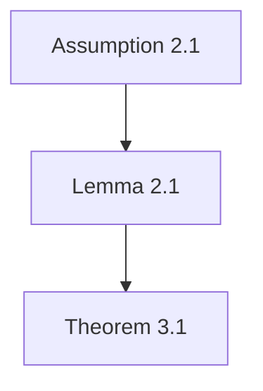

# 任务：检查指定论文中每个定理和引理的证明正确性

## Agent 硬性接口规则

以下规则用于让批处理 agent 能够稳定调用本提示词。用户可以修改证明检查标准和输出结构，但请尽量保留本节中的占位符和约束。

- 本次只检查指定论文：`{{input_file}}`。
- 输入目录为：`{{input_dir}}`。
- 输出目录为：`{{output_dir}}`。
- 最终 Markdown 证明检查结果必须写入：`{{output_file}}`。
- 不要检查 `{{input_file}}` 以外的其他论文；如果同目录下存在与该论文同名或明显相关的 `.tex`、`.md`、`.bib`、附录或补充材料，可以作为辅助材料参考。
- 不要只在最终回复中给出证明检查内容；必须创建或更新 `{{output_file}}`。
- 如果无法读取论文、无法可靠完成证明检查或无法写入输出文件，请在最终回复中明确说明失败原因，并尽量写入一份包含失败原因或部分进度的 Markdown 到 `{{output_file}}`。
- 文件名由 agent 提供。请在 Markdown 文档开头写出你识别到的论文 title、作者和输入文件名。

请检查输入文件 `{{input_file}}` 中每个 Theorem 和 Lemma 的证明正确性，并把结果写入 `{{output_file}}`。

输出语言以中文为主；必要时可以保留英文术语。

---

## 必须完成的核心任务

本任务不是普通论文审稿，而是 proof audit。以下两项是必须完成的：

1. **逐项检查每个 Theorem 和 Lemma 的证明正确性。**
   - 包括正文中的 Theorem / Lemma。
   - 如果正文定理或引理的证明在 appendix、supplementary material 或同名 `.tex` / `.md` 中，也必须追踪并检查。
   - 如果正文没有 Theorem/Lemma，但有 Proposition/Corollary 承担主证明作用，也应纳入检查并说明原因。

2. **检查证明依赖 DAG。**
   - 需要整理每个 Theorem/Lemma 依赖哪些 Definition、Assumption、Lemma、Theorem、Proposition 或外部结果。
   - 需要检查是否存在循环依赖、先使用后证明、引用编号不清、依赖条件不匹配、证明中使用了定理陈述未包含的额外假设等问题。

---

## 工作量控制规则

虽然必须覆盖每个 Theorem 和 Lemma，但不要把任务扩展成全文逐行形式化验证。

请遵守：

- 不要复制长篇证明原文；只摘录关键原文短句和位置。
- 不要逐行重写所有公式推导；只检查影响正确性的关键推导。
- 每个 Theorem/Lemma 的检查应紧凑，优先给出结论、依赖和风险点。
- 如果某个证明很长，请检查证明主线、关键跳步和依赖条件，而不是复写全文。
- 如果 Theorem/Lemma 数量很多，仍然必须全部列入检查，但单项说明可以更短。
- 输出可以较长，但请优先保证覆盖完整性和可读性。

如果任务因 PDF 提取、公式识别或篇幅限制无法完全完成，请不要停在分析阶段。请把已完成部分写入 `{{output_file}}`，并在文档开头标明“部分完成”和未完成清单。

---

## Markdown 数学公式渲染规则

为保证 Markdown 预览器尽可能正确渲染公式，请严格遵守：

- 行内公式使用 `$...$`，例如 `$x_t\in\mathcal X$`。
- 独立公式使用 `$$...$$`，并让开始和结束的 `$$` 各自独占一行。
- 独立公式的 `$$` 行不要缩进，不要放在 Markdown 表格单元格或代码块里。
- 不要使用 `\(...\)` 或 `\[...\]` 作为公式分隔符。
- 不要把公式放进 fenced code block；代码块会导致公式以 TeX 源码显示。
- 表格中只放简短符号或短公式；复杂公式必须放在表格外单独成段。

---

## 引用和可靠性规则

1. 所有关键判断必须附带 `page X, lines Y-Z`。
2. 如果 PDF 没有原生行号，请按抽取文本的页面内可见文本行自行编号，并在开头说明规则。
3. 不要编造不存在的 page、line number、公式、假设、证明步骤或原文。
4. 如果文本/公式抽取不可靠，请明确写：

> 本处由于文本/公式提取不可靠，以下内容可能需要人工核对。

5. 允许保守判断。无法核验时写“无法核验”，不要硬判正确或错误。

---

# 输出结构

## 0. 基本信息

请用简短表格输出：

| 项目 | 内容 |
|---|---|
| Title |  |
| Authors |  |
| Input file | `{{input_file}}` |
| Output file | `{{output_file}}` |
| 是否读取附录/补充材料 | 是/否/无法确认 |
| 行号规则 |  |
| 检查范围 | 全部 Theorem 和 Lemma；必要时包括承担主证明作用的 Proposition/Corollary |
| 完成状态 | 完成/部分完成 |

如果是部分完成，请列出未完成对象。

---

## 1. Theorem / Lemma 完整清单

请列出论文中识别到的每个 Theorem 和 Lemma。若纳入 Proposition/Corollary，也列在同一表中并说明原因。

| ID | 类型 | 原文编号 | 简短主题 | 陈述位置 | 证明位置 | 是否纳入检查 | 初步结论 |
|---|---|---|---|---|---|---|---|

“初步结论”只能从以下选项中选择：

- Appears correct
- Mostly correct with minor gaps
- Significant gap
- Likely incorrect
- Unverifiable
- No proof found
- Not checked

要求：

- 不要遗漏正文 Theorem/Lemma。
- 如果证明在附录，证明位置写附录页码和行号。
- 如果找不到证明，写 `No proof found`。

---

## 2. 证明依赖 DAG 检查

请整理证明依赖关系。可以用 Mermaid，也可以用缩进列表。优先使用 Mermaid，节点标签要简短。

示例：

随后给出依赖表：

| 结果 | 直接依赖 | 依赖依据 | 是否已在使用前定义/证明 | 问题 |
|---|---|---|---|---|

必须检查：

- 是否存在循环依赖；
- 是否存在先使用后证明但未说明的依赖；
- 定理/引理使用的假设是否都在陈述中或前文明确给出；
- 附录证明是否引入正文未声明的额外条件；
- 外部定理是否有足够引用和适用条件说明。

---

## 3. 逐项证明正确性检查

对 Part 1 中每个纳入检查的 Theorem/Lemma 逐项输出。每项保持紧凑，但必须给出明确结论。

### Result ID：类型 + 原文编号 + 简短主题

**陈述位置**：page X, lines Y-Z  
**证明位置**：page X, lines Y-Z / No proof found / Unverifiable

**结论摘要**：用 2-4 句话说明该结果声称什么。

**关键依赖**：

| 依赖 | 类型 | 位置 | 是否足够 |
|---|---|---|---|

最多列出 8 个关键依赖。不要列无关背景定义。

**证明主线**：

用 3-8 个 bullet 概括证明逻辑。每个 bullet 尽量附位置。

**正确性检查**：

| 检查点 | 判断 | 说明 |
|---|---|---|
| 假设是否覆盖证明所需条件 | 是/否/不确定 |  |
| 关键推导是否成立 | 是/否/不确定 |  |
| 依赖结果是否已定义/证明/引用 | 是/否/不确定 |  |
| 是否存在隐藏条件或量词问题 | 是/否/不确定 |  |
| 是否存在明显符号/编号不一致 | 是/否/不确定 |  |
| 是否影响主结果 | 是/否/不确定 |  |

**单项结论**：从以下选项中选择一个，并给出 1 段理由。

- Appears correct
- Mostly correct with minor gaps
- Significant gap
- Likely incorrect
- Unverifiable
- No proof found

---

## 4. 全局证明问题汇总

请列出最值得人工复核的问题，按严重程度排序。

| 严重程度 | 涉及结果 | 位置 | 问题 | 影响 | 建议 |
|---|---|---|---|---|---|

严重程度从以下选项中选择：

- Critical
- Major
- Minor
- Cosmetic

如果没有明显问题，也请列出最需要人工快速复核的几个关键点。

---

## 5. 总体证明可靠性评价

请选择一个总体结论：

- Proofs appear correct
- Proofs are mostly correct with minor gaps
- Proofs have significant gaps
- At least one main result appears likely incorrect
- Proofs are largely unverifiable from the provided manuscript

评分：

| 维度 | 评分 1-5 | 理由 |
|---|---:|---|
| 覆盖完整性 |  |  |
| 证明完整性 |  |  |
| 证明严谨性 |  |  |
| 依赖 DAG 清晰度 |  |  |
| 假设透明度 |  |  |
| 符号一致性 |  |  |
| 可人工复核性 |  |  |

最后用 1-2 段说明这些证明风险会如何影响审稿判断。

---

## 6. 给作者的问题

列出最多 8 个具体、可回答的问题。

| 编号 | 问题 | 涉及结果 | 位置 | 为什么重要 |
|---|---|---|---|---|

---

## 7. 自检清单

- [ ] 已说明行号生成方式；
- [ ] 已列出所有识别到的 Theorem 和 Lemma；
- [ ] 每个 Theorem/Lemma 都给出陈述位置和证明位置；
- [ ] 每个 Theorem/Lemma 都给出正确性结论；
- [ ] 已检查证明依赖 DAG；
- [ ] 已检查循环依赖、先使用后证明和隐藏假设；
- [ ] 所有关键判断都有 page/line 依据；
- [ ] 已明确区分作者原文、审稿人解释和审稿人推断；
- [ ] 未编造 page number、line number、公式、证明步骤或原文；
- [ ] 已给出总体证明可靠性评价。
